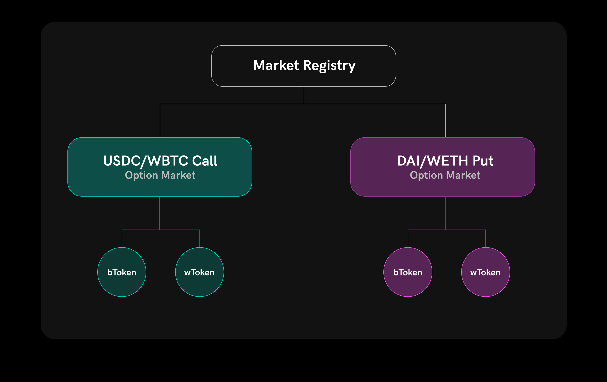
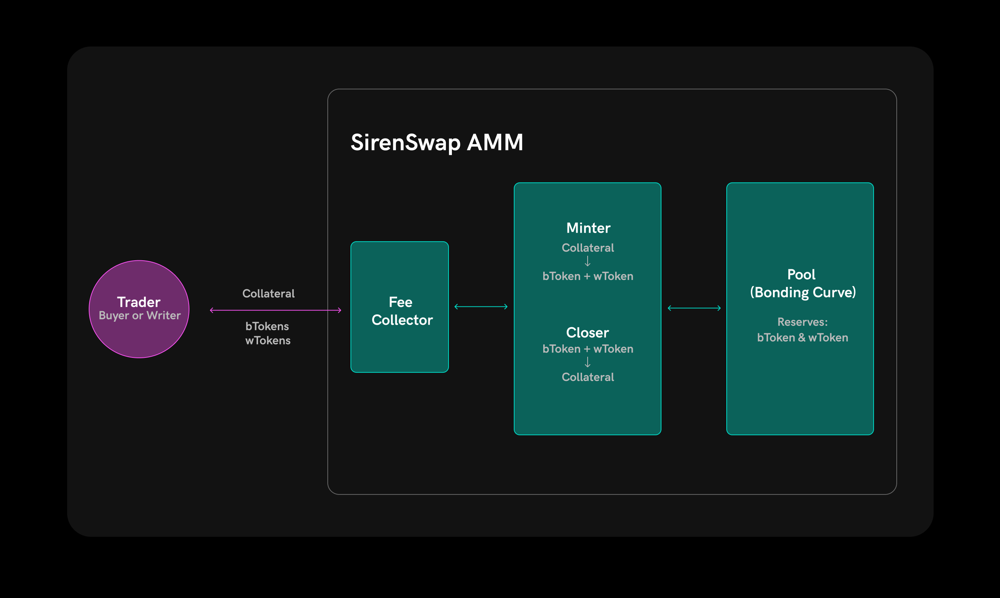

# SIREN Protocol

## About SIREN

The developers and designers at SIREN have been working on a protocol for decentralized options trading, and we’d like to share our thoughts on it with you here. Options are a financial primitive from which one can build many different more complex financial instruments. At their core, options give a trader the choice to buy or sell an asset at a predetermined price at a known time in the future. This is useful for protecting yourself \(a.k.a hedging\) against possible price changes in the asset, as well as speculating on these price changes.

Please continue reading for a high-level description of the unique components we’re working on to allow you to create and trade options for any ERC20 asset. We describe the core mechanics of how Siren Options are written and traded using an Automated Market Maker specifically designed for options, and the role the SIREN governance token plays in coordinating the options markets.

### Core Protocol Mechanics

Siren uses a fully-collateralized approach to writing options that doesn’t require any oracles to function. A single MarketsRegistry contract creates and coordinates individual markets. Once a Market contract is created anyone can interact with it in a permissionless manner. The solvency of a position is ensured at all times by the collateral locked in the smart contract.

In Siren both the long and short side of the contract are tokenized. The buyer’s side \(`bToken`\) gives the holder the right to purchase the underlying asset at a predetermined [strike price](https://www.investopedia.com/terms/s/strikeprice.asp). The seller’s/writer’s side \(`wToken`\) allows the holder to withdraw the collateral \(if the option was not exercised\) or withdraw the exercise payment \(if the option was exercised\) from the contract after expiration.

Tokenizing both sides of the contract allows Siren to create secondary markets for both the long and short exposure. Under such a design in order to become a writer one purchases a wToken from the SirenSwap AMM \(see below\). A writer can also unwind their short exposure by selling the wToken back to the AMM. This streamlines the write-side mechanics by reducing it to essentially purchasing the underlying collateral at discount — as opposed to a typical design where the writer mints long tokens and has to then sell them in order to realize the premium.

### SirenSwap AMM

Bootstrapping liquidity is core to creating a thriving market. Options are notoriously difficult when it comes to that. Not only does liquidity get fractured by combination of strike prices and expirations, it also requires sophistication on the part of liquidity providers in order to ensure fair and sustainable pricing.

To ensure liquidity on day 1 we designed a custom SirenSwap AMM that uses a novel combination of a constant-product bonding curve and options minting to trade both bTokens and wTokens. Notably, the AMM doesn’t require any asset in the pool other than bTokens/wTokens in order to trade them against the collateral asset \(e.g. WBTC\). This increases LP capital efficiency and provides other benefits that we’ll expand on in further posts.

We believe that in these early days of Ethereum and DeFi less is more, so we designed SirenSwap to be a model-less market maker. This means there is no complex on-chain pricing formula nor oracle feed required in order for it to function. This makes it easy for anyone to become an LP and earn trading fees.

### Governance

There will be a governance token for Siren Markets, called SIREN. This token allows holders to create new option markets, and determine the fee rate for writing, closing, and redeeming an option. These fees accrue to SIREN token holders. Upon launch these fees will be set to 0 to reduce the friction in using Siren options, but will likely increase if the DeFi community adopts Siren options.

#### TODO; Add closing content and what reader's should do next

Join community

Read how to get started trading options

Etc.

