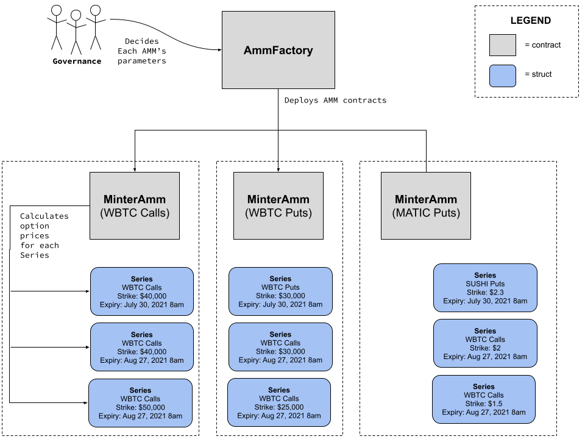

# Contract Architecture

## Architecture Diagrams

### Series Diagram

### Options AMM (Automated Market Maker) Diagram

### Full Protocol Diagram

## Architecture Overview

At its core, the SIREN protocol is a set of contracts for creating and interacting with [covered options](https://www.investopedia.com/terms/c/coveredcall.asp) on `ERC20` assets. Every option is specified by the [Series](glossary.md#series) data structure (see the [TradFi definition of a series](https://www.investopedia.com/terms/o/optionseries.asp)).

A Series struct specifies the parameters of the option, but we need an additional data structure to represent the [long and the short side](https://www.investopedia.com/ask/answers/100314/whats-difference-between-long-and-short-position-market.asp) of the option. To represent the long side (i.e. owning an option) we use an [ERC1155](glossary.md#erc1155) token we call a [bToken](glossary.md#btoken) and for the short side (i.e. underwriting the option) we use an [ERC1155](glossary.md#erc1155) token we call a [wToken](glossary.md#wtoken). The term [option tokens](glossary.md#option-tokens) is a simple blanket term which can refer to a bToken, a wToken, or both. The Solidity logic for handling these ERC1155 tokens is implemented in the [ERC1155Controller](erc1155-controller.md#overview).

Having an option Series as well as the option tokens representing the long/short side is a good start, but the protocol needs a way to interact with these Series so that we can do useful things with them. We need to be able to create new Series based on user demand, we need a way to mint new option tokens using collateral supplied by the [LP's](glossary.md#liquidity-providers), we need a way to exercise bTokens when the Series expires and is [in the money](glossary.md#in-the-money-option), we need a way for wToken holders to claim their collateral when the Series expires and is [out of the money](glossary.md#out-of-the-money-option), and we need a way to close out a position by burning equal amounts of bToken and wToken for collateral. All of this is handled by the [SeriesController](series-controller.md#overview).

The SeriesController needs somewhere to store the collateral token it receives when minting new option tokens (bTokens and wTokens). It could store the collateral on itself, but then the protocol would run into trouble when different Series use the same collateral token (this is the case for all Series representing [Put](glossary.md#put-option) options, which all use [USDC](glossary.md#usdc) as their collateral token). How would the SeriesController differentiate between the two amounts of Series collateral!? If we could store them in a separate contract, then the SeriesController would only need to store a mapping between a Series and its collateral token amount. That's why the protocol has the [SeriesVault](series-vault.md#overview) contract, whose job is to receive, store, and send collateral tokens to the SeriesController.

Options are different from their underlying assets in a very important way; their value and lifecycle depend on time. As time progresses, the price of the option's [underlying](glossary.md#underlying-token) market price changes, and the option can go [in](glossary.md#in-the-money-option) or [out](glossary.md#out-of-the-money-option) of the money. The protocol needs a way to get current market price of a Series' underlying token, and it needs a way to store that price upon a Series' expiration so that option tokens can be [redeemed](glossary.md#option-redemption) at their correct value. The [PriceOracle](price-oracle.md#overview) contract implements this functionality. It relies on an onchain price oracle (for instance, Chainlink or Uniswap v3) to fetch the current market prices, and it relies on an offchain bot process to set each Series' settlement price as soon as the Series expires.

The last crucial component of the SIREN protocol is a contract which implements the logic for pricing option tokens, and the logic for buying + selling options. The [MinterAmm](minter-amm.md#overview) contract handles this. It uses a Black-Scholes option pricing algorithm to implement a [theta-decay](glossary.md#theta-decay)-aware bonding curve for pricing onchain options. In addition, it has the ability to mint bTokens, and so can offer infinite trading depth. This is where SIREN differentiates itself from other option protocols such as [Opyn](https://www.opyn.co/) where Opyn uses 0x to trade options. SIREN's choice to closely couple the option settlement layer (i.e. the SeriesController) to the AMM layer (i.e. the MinterAmm) allows for novel options functionality that exists no where else in DeFi. Time will tell if the decision to couple these layers was folly, or madness :D.

## A Note on Contract Upgradeability

All contracts mentioned above make use of the [EIP-1822 Universal Upgradeable Proxy Standard](https://eips.ethereum.org/EIPS/eip-1822). The contracts users interact with are actually instances of the SIREN [Proxy contract](glossary.md#proxy-contract), which point to the logic address the user wants to use (e.g. SeriesController, or MinterAmm). The SIREN team chose this so that in the event of a security vulnerability there is a straightforward mechanism for patching the vulnerability. This also means the contracts could be upgraded in a malicious manner if the admin account were ever compromised. To protect against this dreadful possibility, the admin account is a [Gnosis Safe Wallet](https://gnosis-safe.io/) which requires multiple signatures from keys all protected by hardware wallets.

## Protocol Contracts In Depth

[**AmmFactory**](amm-factory.md#overview) A [factory](https://betterprogramming.pub/learn-solidity-the-factory-pattern-75d11c3e7d29) contract for deploying and accounting for new [`MinterAmm`](minter-amm.md#overview) contracts.

[**SeriesController**](series-controller.md#overview) A contract for creating [Series](glossary.md#series) and managing the lifecycle of those Series.

[**ERC1155Controller**](erc1155-controller.md#overview) A contract that inherits from the [Open Zeppelin ERC1155PresetMinterPauser contract](https://docs.openzeppelin.com/contracts/4.x/erc1155#Presets), and is used by the [SeriesController](series-controller.md#overview) to interact with option tokens.

[**SeriesVault**](series-vault.md#overview) A contract that is set as the owner of all `ERC20` collateral used by the [SeriesController](series-controller.md#overview) when minting option tokens.

[**PriceOracle**](price-oracle.md#overview) A contract that the [SeriesController](series-controller.md#overview) uses to fetch current market prices as well as [Series](glossary.md#series) settlement prices.

[**Series**](series.md#overview) A struct (not a contract) that holds the necessary fields to represent an onchain option for `ERC20` assets.

[**MinterAmm**](minter-amm.md#overview) A contract that implements an Automated Market Maker for SIREN options.
