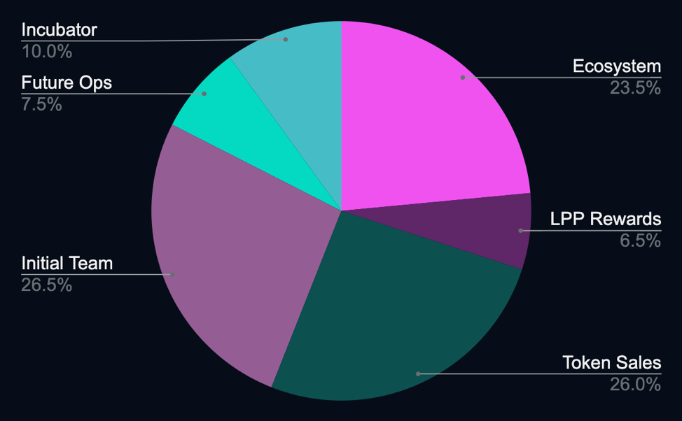

# Product Strength

## Why options on cryptocurrencies?

Cryptocurrency has become more attractive as an asset class over time, with firms such as Tesla publicly announcing support for Bitcoin transactions and holding Bitcoin on their balance sheet. As cryptocurrency rises in popularity, people have demonstrated an increased appetite to interact with the DeFi ecosystem in ways that model more traditional centralized finance — trading assets, staking tokens to farm rewards similar to an annuity or bond, and more. However, there has not previously been a high-quality decentralized solution for cryptocurrency options trading that offers the features of a traditional finance platform.

Options are an asset with a large market in traditional finance, with more than $300 trillion of notional volume traded every year. Options play a crucial role in allowing investors to hedge their positions, multiply their holdings via multi-option spreads, and more effectively match a portfolio to a model of potential future market volatility. Sophisticated traders expect to be able to construct complex portfolio positions and to move in and out of the buyer’s and writer’s sides of options with minimal friction. SIREN is currently the only DeFi platform that allows for this level of flexibility and composability of assets and their derivatives.

##Why are you better than competitors?

SIREN fills a unique market niche by catering specifically to sophisticated parties interested in holding and actively trading tokenized options contracts. Unlike any other cryptocurrency options platform, SIREN has tokenized both sides of an option contract, allowing for elements of an options ecosystem. SIREN allows for both buyers and writers to mint, buy, and trade in and out of options positions at any time.

In addition to our unique tokenization model, we have also separated our automated market making (AMM) layer from the settlement layer, which allows us to continuously modify the design of our market making, pool administration, and pricing as the trading volume and liquidity of our platform grows over time. Under this paradigm, a strategy that serves SIREN in our early stage of growth with a limited number of markets and available liquidity does not need to be the same strategy that serves during future high growth periods.

Finally, we are a team of experienced developers and executives. Many of us have experience in previously successful cryptocurrency companies, some of which you have almost certainly heard of. We have experience writing software that protects billions of dollars, both off-chain and on-chain.

## Where is your Whitepaper?

https://sirenmarkets.com/whitepaper/

## Where can I find your Roadmap?

https://sirenmarkets.medium.com/sirenv2-and-2q2021-roadmap-91b215f1dfdc

## What are the tokenomics of SI?

SI is an ERC-20 native token. The function of the token is governance; in the future - as well owning a share of the fees generated by the protocol. 

### Token Supply

100,000,000 tokens total, distributed among the following tranches:
- 34,000,000 SI: Current team, future team, and advisors.
- 10,000,000 SI: Early incubator that invested in the development of SIREN.
- 26,000,000 SI: Previously sold and future unsold positions of investor tokens, to the extent they fully exercise their rights to purchase SI.
- 30,000,000 SI: Ecosystem and rewards, which will benefit traders, LPs, and developers who participate in the SIREN ecosystem.

### Circulating supply

https://www.coingecko.com/en/coins/siren

### Lockups on tokens

- All team tokens have a minimum one year full lockup and a total four year unlock schedule.
- All private investors have a minimum one year lockup schedule and a total two year unlock schedule.

### History of the SIREN reward programs
 
1 . The first SIREN Liquidity Provider Program (LPP) ran from the beginning of December 2020 until the end of February 2020 for two pools, WBTC and the corresponding USDC; the TVL at the end of the first LPP exceeded $14MM USD, and 5MM SI tokens were released with the 3 month lockup
https://gov.sirenmarkets.com/t/sip-2-liquidity-mining-emission-proposal/18
https://medium.com/siren-markets/the-siren-liquidity-provider-program-1e9841746ff2
https://medium.com/siren-markets/expanding-the-siren-lpp-c69969e25d41

2 . The second LPP releases 1.5MM immediately claimable SI tokens over a 13-week program (50% upfront rewards and 50% distribution over a 12 week linear schedule), starting from Feb 26 until May 28; the goal is to provide rewards across multiple different asset pools — we began with SUSHI and the respective USDC
https://gov.sirenmarkets.com/t/sip-6-liquidity-mining-emission-proposal-for-next-erc-20-pairing/141
https://gov.sirenmarkets.com/t/sip-8-lpp-extension-and-vesting-schedule/157

3 . A Balancer Liquidity Bootstrapping Pool (LBP) event occurred on March 3-5, 2021 with the aim to distribute SI tokens to the community; we gained over 1000 unique token holders and distributed 3MM SI tokens
https://gov.sirenmarkets.com/t/sip-7-si-token-distribution-event/146
https://medium.com/siren-markets/si-token-distribution-event-cff0be106fc6

4 . SI Staking Program starts a staking pool for SI will help absorb some of the sell pressure from early liquidity providers
https://gov.sirenmarkets.com/t/sip-9-introduce-si-staking/174

_NOTE: This is a living document that will continue to be updated as SIREN evolves. To contribute, please visit_ [_SIREN on GitHub_](https://github.com/sirenmarkets/core)_. Specific questions may be answered and technical guidance may also be provided from time to time in the_ [_SIREN Discord_](https://discord.gg/JMcDB52Y) _to those who are interested in building on top of the protocol._
